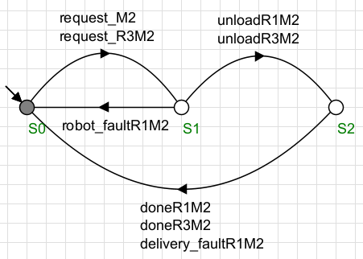

# Controle de um Sistema de Robôs Autônomos em um Armazém

## Descrição geral

Em um armazém automatizado, dois robôs móveis transportam caixas de insumos 
entre um Buffer de Entrada (BE) e máquinas de processamento. Cada robô tem uma 
rota específica e restrições operacionais que garantem a segurança e eficiência do 
transporte.

Os robôs seguem trajetórias predefinidas, e eventos como solicitações de 
transporte e falhas podem ocorrer. Um supervisor foi modelado utilizado o software Supremica, ele controla os robôs garantindo 
operação segura e eficiente. 

## Objetivos

O projeto tem como objetivo desenvolver um modelo de controle supervisionado
para um sistema de robôs móveis em um armazém utilizando autômatos finitos e 
a ferramenta Supremica. Os principais objetivos são:
1. *Modelar o sistema de transporte de insumos* \
  a. Representar o comportamento dos robôs usando autômatos finitos. \
  b. Definir estados e transições para o transporte de caixas entre o buffer 
de entrada e as máquinas de processamento.  
2. *Implementar a especificação e gerar o supervisor* \
  a. Modelar restrições de segurança usando autômatos de 
especificação. \
  b. Utilizar o Supremica para a síntese do supervisor, garantindo que o 
sistema opere corretamente. 
3. *Simular e validar o comportamento do sistema* \
  a. Testar diferentes cenários de transporte para verificar se o supervisor 
evita colisões e bloqueios. \
  b. Avaliar a performance do sistema quanto à entrega eficiente dos 
insumos às máquinas. 

## Funcionamento do sistema

### Principais componentes
1. Número de robôs: 3 robôs autônomos (R1, R2 e R3). 
2. Número de máquinas: 4 máquinas de processamento (M1, M2, M3, M4).
3. Buffer de Entrada (BE): local onde os robôs retiram os insumos antes de 
entregá-los às máquinas.

### Regras do operacionais
1. *Rotas dos robôs*\
  a. R1: Transporta caixas do Buffer de Entrada (BE) para as máquinas M1 
e M2.\ 
  b. R2: Transporta caixas do Buffer de Entrada (BE) para as máquinas M3 
e M4.
  c. R3: substitui R1 ou R2 em caso de falha.

## Eventos

### Eventos controláveis

- *moveRiMx*: Ri transporta uma caixa do BE para a máquina Mx;
- *unloadRiMx*: Ri descarrega um caixa na máquina Mx;
- *doneRiMx*: Ri foi liberado da máquina Mx para um novo transporte.

### Eventos não controláveis

- *request_Mx*: Uma solicitação de transporte surge para a máquina Mx (R1 ou R2 são requisitados);
- *request_R3Mx*: Uma solicitação de transporte surge para a máquina Mx (R3 é solicitado substituindo R1 ou R2);
- *robot_faultRiMx*: O robô Ri apresenta falha no transporte para a máquina Mx;
- *delivery_faultRiMx: A máquina Mx detectou um falha na entrega de uma caixa pelo robô Ri;
- *robot_resetRi*: Robô Ri voltou a funcionar normalmente.

## Autômatos Modelados

### Autômato para o robô R1

  

### Autômato para o robô R2

  

### Autômato para o robô R3

  

### Autômato para a máquina M1

  

### Autômato para a máquina M2

  

### Autômato para a máquina M3

  

### Autômato para a máquina M4

  

### Simulação

  

### Analizador

  

O supervisor sintetizado possui 84 estados e 212 eventos.

### Supervisor sintetizado

  

### Verificação de controlabilidade e não bloqueabilidade do supervisor

  

Vídeo do Youtube com a explicação do projeto: (https://youtu.be/iXAAy7FvzKo)

